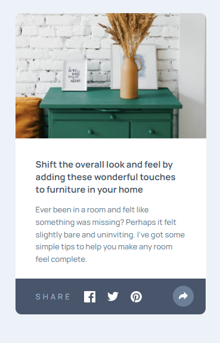
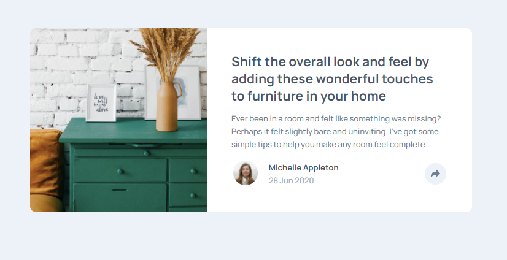

# Frontend Mentor - Article preview component solution

This is a solution to the [Article preview component challenge on Frontend Mentor](https://www.frontendmentor.io/challenges/article-preview-component-dYBN_pYFT). Frontend Mentor challenges help you improve your coding skills by building realistic projects. 

## Table of contents

  - [The challenge](#the-challenge)
  - [Screenshot](#screenshot)
  - [Links](#links)
  - [Built with](#built-with)
  - [What I learned](#what-i-learned)
- [Author](#author)
### The challenge

Users should be able to:

- View the optimal layout for the component depending on their device's screen size
- See the social media share links when they click the share icon

### Screenshot

### Links

- Solution URL: [https://github.com/sunnyyuanz/article-preview-component-master]
- Live Site URL: [https://sunnyyuanz.github.io/article-preview-component-master/]

### Built with

- Semantic HTML5 markup
- CSS custom properties
- Flexbox
- CSS Grid
- Javascript

### What I learned

- Using classList to control the style in javascript instead
- Changing svg img color using filter
- First time using z-index to bring element forward

## Author

- Website - [SunnyZ](https://github.com/sunnyyuanz)
- Frontend Mentor - [@sunnyyuanz](https://www.frontendmentor.io/profile/sunnyyuanz)